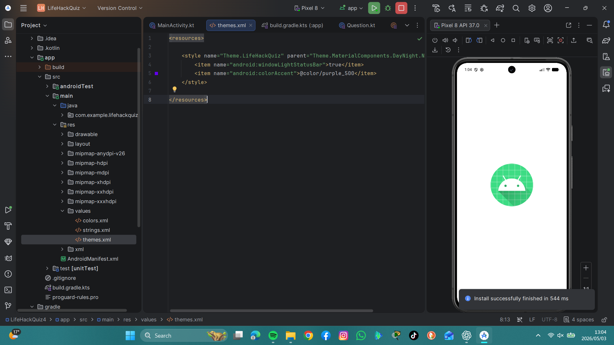
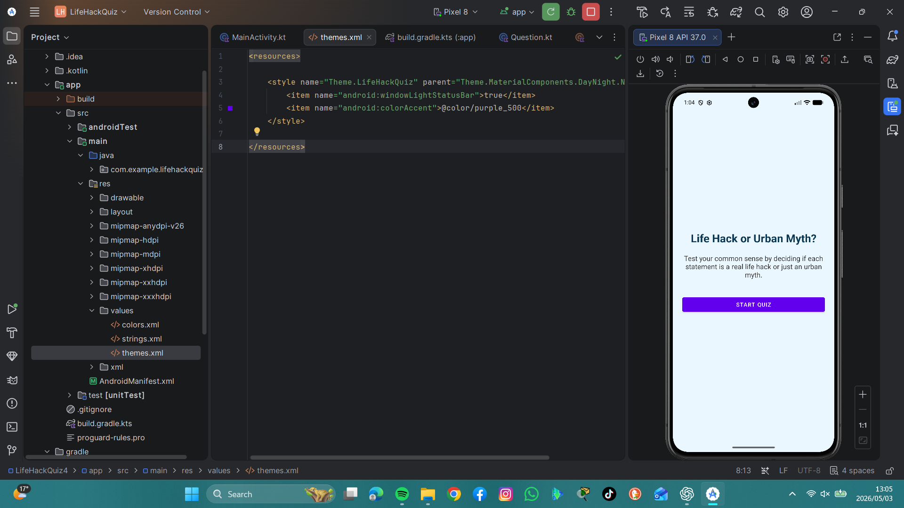
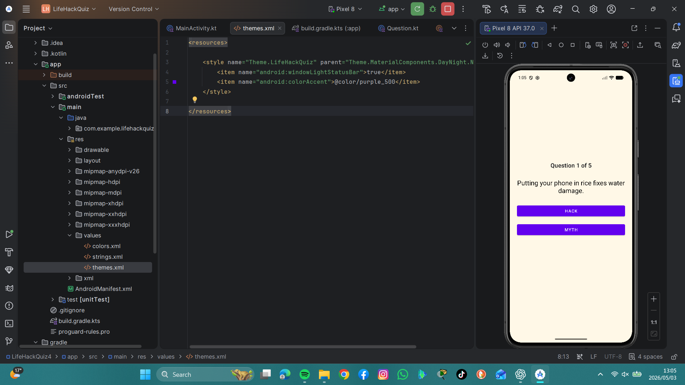
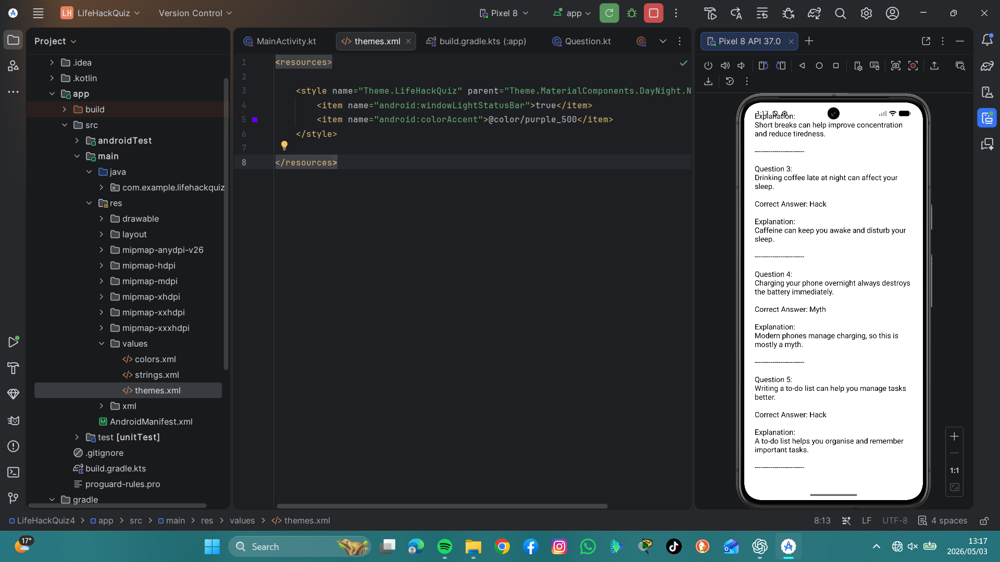
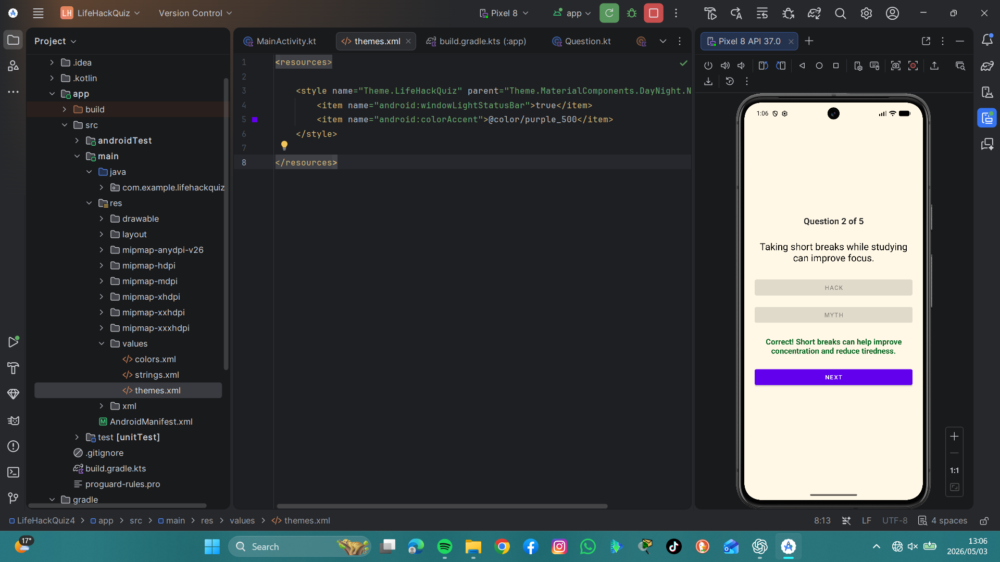
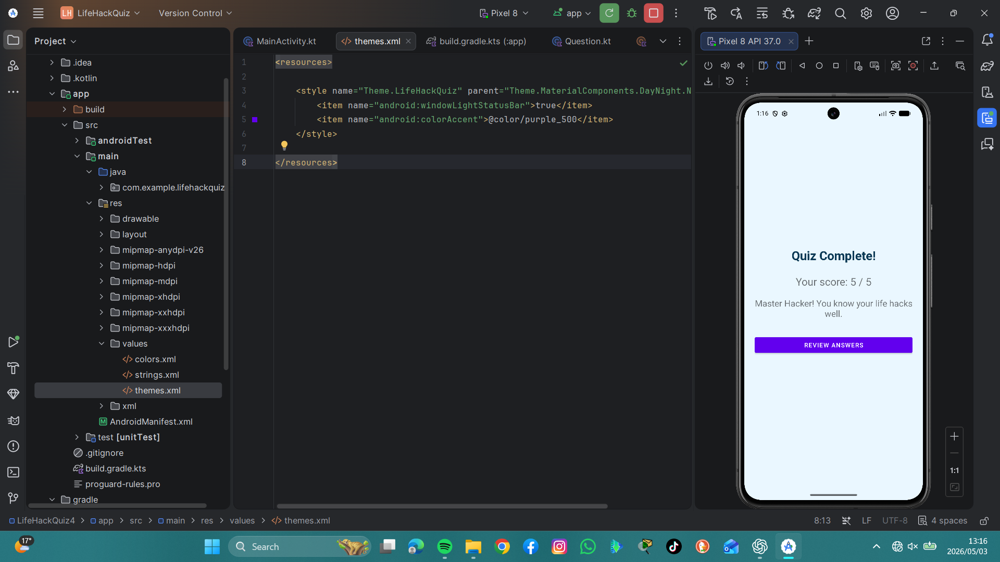
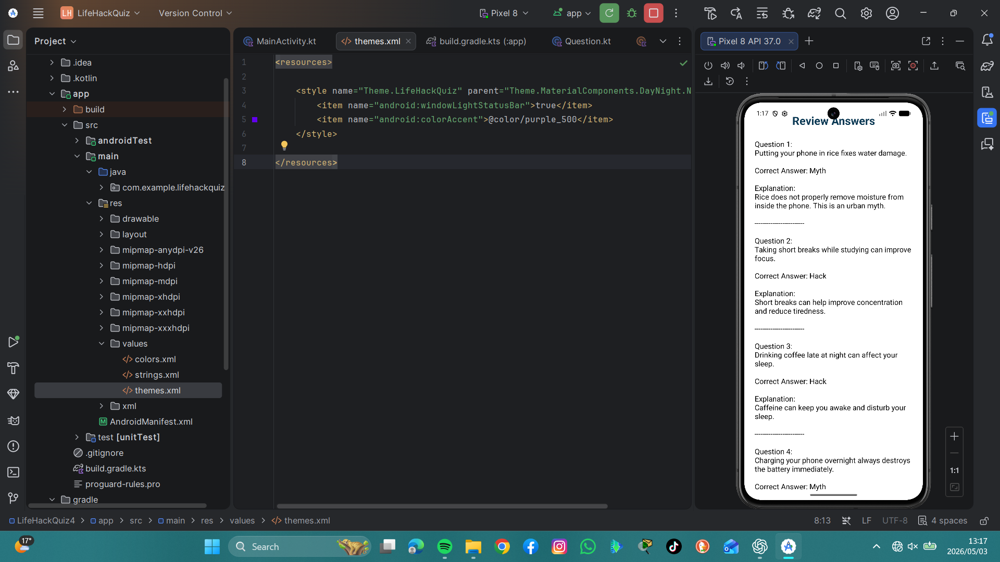

LifeHackQuiz App

Overview
This is an Android quiz app developed using Kotlin.  
The app tests users on Life Hacks and Urban Myths.

Features
- Multiple-choice quiz (Hack vs Myth)
- Instant feedback after answering
- Score tracking
- Final score screen
- Review answers screen

Technologies Used
- Kotlin
- Android Studio
- XML Layouts

## Screenshots

### Main Screen

  
  

### Quiz Screen

### Feedback

### Score Screen

### Review Screen

How to Run
1. Open the project in Android Studio
2. Connect an emulator or device
3. Click Run 

Author
Student Number: ST10533474
Nelly Mgijima
